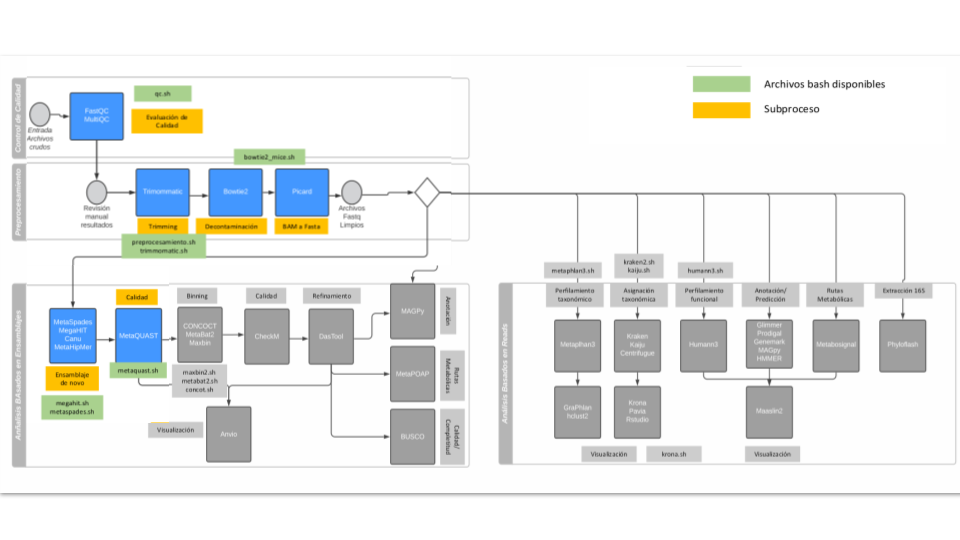

# **nf-metagenome**

Nextflow pipeline to analyse metagenome data

------------------------------------------------------------------------

### Workflow overview

------------------------------------------------------------------------

### Input

-   Directory whith compressed FASTQ files

-   Output directory path

### Output

-   Multiqc report (Fastq, Trimmomatic, Bowtie2)
-   Metagenome assemblies
-   metaQuast report

------------------------------------------------------------------------

### Requirements

Compatible OS\*:

-   Ubuntu 20.04 LTS

### Software

| Requierment | Version  | Required Commands \* |
|-------------|----------|----------------------|
| Java        | v11.0.11 | java                 |
| Nextflow    | 21.10.5  | nextflow run         |
| Docker      | 20.10.11 | pull, build          |

-   These commands must be accessible from your \$PATH (i.e. you should be able to invoke them from your command line). \*\* Plan9 port builds many binaries, but you ONLY need the mk utility to be accessible from your command line.

### Installation

Download from Github repository:

    git clone 

------------------------------------------------------------------------

Build docker image

    cd nf-metagenome && cd docker && docker build -t nf_metagenome .

#### Test

To test nf-metagenome execution using test data, run:

    ./runtest.sh 

Your console should print the Nextflow log for the run, once every process has been submitted, the following message will appear:

     ======
     Basic pipeline TEST SUCCESSFUL
     ======

results for test data should be in the following directory:

    ./nf-metagenome/test/results/

------------------------------------------------------------------------

### Usage

To run with your own data go to the pipeline directory and execute:

    nextflow run nf-metagenome.nf \
      --fastq_dir $your_fastq_directory \
      --output_dir $your_output_directory \
      -resume \
      -with-report $your_output_directory/`date +%Y%m%d_%H%M%S`_report.html \
      -with-dag $your_output_directory/`date +%Y%m%d_%H%M%S`.DAG.html \
        -with-timeline $your_output_directory/`date +%Y%m%d_%H%M%S`_timeline.html \
        -with-docker

### Important

Params for trimming must be modified in the nextflow.config file

-   Meaning: trim_avgqual, trim_leading, trim_trailing, etcetera.

------------------------------------------------------------------------

For information about options and parameters, run:

    nextflow run nf-metagenome.nf --help

------------------------------------------------------------------------

#### Authors

Israel Aguilar Ordoñez
